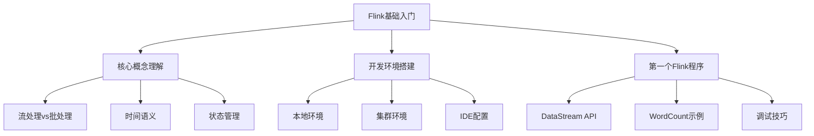
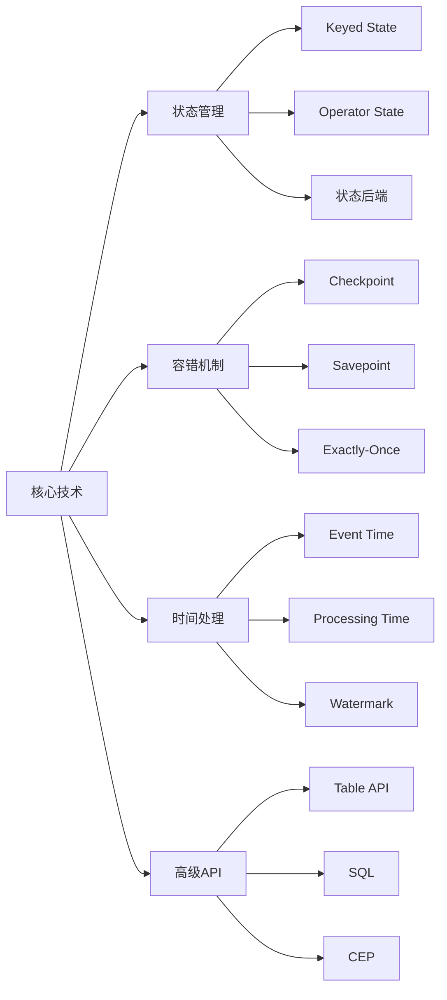
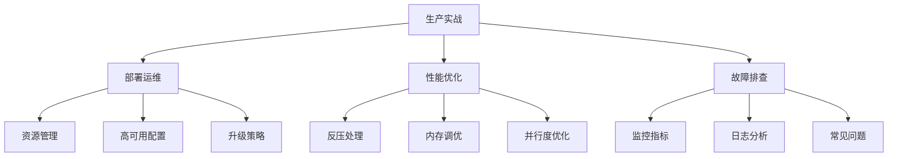
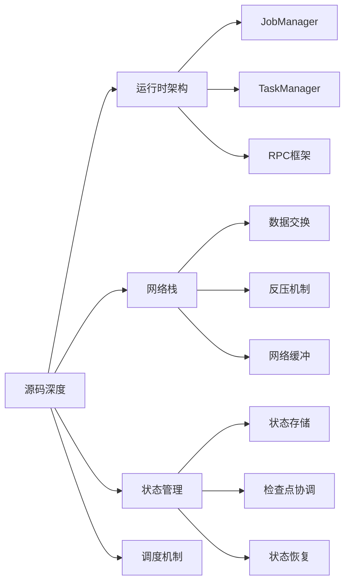
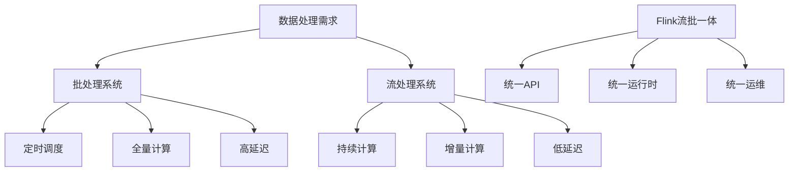

<!-- more -->


## 🎯 Flink 在分布式计算领域的地位

​**Flink 技术定位矩阵**：

```
流处理领域：Flink vs Spark Streaming vs Storm
├── 低延迟：Flink (毫秒级) > Spark Streaming (秒级) > Storm (毫秒级)
├── 高吞吐：Flink ≈ Spark Streaming > Storm
├── 精确一次语义：Flink (原生支持) > Spark Streaming (微批处理) > Storm (Trident)
└── 状态管理：Flink (强大) > Spark Streaming (有限) > Storm (弱)
```

## 📊 Flink 技术体系架构图

```
Flink 完整技术栈
├── 核心引擎层
│   ├── 运行时架构
│   │   ├── JobManager (作业管理器)
│   │   ├── TaskManager (任务管理器)  
│   │   └── ResourceManager (资源管理器)
│   ├── 内存管理
│   │   ├── 网络缓冲区
│   │   ├── 托管内存
│   │   └── 原生内存
│   └── 容错机制
│       ├── Checkpoint (检查点)
│       ├── Savepoint (保存点)
│       └── 状态后端
├── API 层
│   ├── DataStream API (流处理)
│   ├── DataSet API (批处理，已渐淘汰)
│   ├── Table API & SQL
│   └── Python API
├── 连接器生态
│   ├── 输入连接器
│   │   ├── Kafka
│   │   ├── File System
│   │   ├── RabbitMQ
│   │   └── 自定义 Source
│   ├── 输出连接器
│   │   ├── Kafka
│   │   ├── Elasticsearch
│   │   ├── JDBC
│   │   └── 自定义 Sink
│   └── 格式支持
│       ├── JSON
│       ├── Avro
│       ├── Parquet
│       └── Protobuf
├── 部署模式
│   ├── Session 模式
│   ├── Per-Job 模式
│   ├── Application 模式
│   └── 云原生部署
└── 运维监控
    ├── Metrics 系统
    ├── Web UI
    ├── 日志集成
    └── 告警系统
```

## 🚀 Flink 学习路线

### 阶段一：基础入门 (2-3 周)

**目标**：掌握 Flink 核心概念和基础编程



​**学习重点**：

- Flink 架构和核心概念
- DataStream API 基础使用
- 时间窗口和 Watermark 机制
- 本地和集群环境部署

### 阶段二：核心技术深度掌握 (4-6 周)

**目标**：深入理解 Flink 核心机制和高级特性



**学习要求：**

- 深入理解状态后端原理（Heap、RocksDB）
- Checkpoint 机制源码级理解
- 端到端精确一次语义实现
- 自定义 Source/Sink 开发

### 阶段三：生产环境实战 (4-5 周)

**目标**：掌握企业级部署、监控和优化



​**企业级技能**：

- Kubernetes 部署和运维
- 监控告警体系搭建
- 性能调优和瓶颈分析
- 大规模集群管理经验

### 阶段四：源码级深度 (6-8 周)

**目标**：达到源码理解能力，能够参与社区贡献



​**P7+ 要求**：

- 能够阅读和调试核心模块源码
- 理解 Flink 架构设计哲学
- 具备性能问题深度排查能力
- 能够进行定制化开发和优化

## 🧠 Flink 核心技术思维导图

- Flink 技术体系

  - 核心概念

    - 流处理范式
    - 时间语义

      - Event Time
      - Processing Time
      - Ingestion Time
    - 状态管理

      - Keyed State
      - Operator State
      - State Backend
    - 容错机制

      - Checkpoint
      - Savepoint
      - Exactly-Once
  - API 体系

    - DataStream API

      - 转换操作
      - 窗口计算
      - 异步 IO
    - Table API & SQL

      - 关系型操作
      - UDF 开发
      - 流批统一
    - CEP 复杂事件处理

      - 模式匹配
      - 规则引擎
  - 运行时架构

    - JobManager

      - 调度器
      - Checkpoint 协调
    - TaskManager

      - 任务执行
      - 网络栈
      - 内存管理
    - ResourceManager

      - 资源分配
      - 动态扩展
  - 连接器生态

    - 消息队列

      - Kafka
      - Pulsar
      - RocketMQ
    - 存储系统

      - HDFS/S3
      - JDBC
      - Elasticsearch
    - 自定义连接器

      - SourceFunction
      - SinkFunction
  - 部署运维

    - 部署模式

      - Standalone
      - YARN
      - Kubernetes
    - 监控告警

      - Metrics 系统
      - 日志聚合
      - 性能监控
    - 高可用配置

      - ZooKeeper 集成
      - 故障恢复
  - 高级特性

    - 流批一体

      - DataStream 批处理
      - Table API 统一
    - SQL 实时化

      - 持续查询
      - 动态表
    - 状态迁移

      - 序列化兼容
      - 升级策略

## 💡 Flink 解决的核心问题

### 1. 流处理的本质挑战

- ​**低延迟与高吞吐的平衡**
- ​**状态管理的复杂性**
- ​**故障恢复的精确性**
- ​**时间处理的准确性**

### 2. 与传统批处理的区别



### 3. 在数据架构中的定位

```
现代数据架构
├── 采集层：Kafka, Pulsar
├── 计算层：Flink (实时计算核心)
├── 存储层：ClickHouse, HBase, Iceberg
└── 服务层：API, 数据服务
```

## 🎯 能力要求 Checklist

### 技术深度

- [ ] 深入理解 Flink 运行时架构和原理
- [ ] 掌握状态管理和容错机制源码
- [ ] 能够进行生产环境性能调优
- [ ] 具备大规模集群运维经验

### 架构设计

- [ ] 能够设计企业级实时数仓
- [ ] 掌握流批一体架构设计
- [ ] 具备高可用和高性能架构设计能力
- [ ] 能够进行技术选型和架构演进

### 工程能力

- [ ] 源码阅读和调试能力
- [ ] 问题定位和解决能力
- [ ] 性能优化和瓶颈分析
- [ ] 监控体系和告警设计

## 📚 推荐学习资源

### 官方资源

- Flink 官方文档（必读）
- Apache Flink 源码（GitHub）
- Flink 改进提案（FLIP）

### 书籍推荐

- 《Stream Processing with Apache Flink》
- 《Fink 基础教程》
- 《Apache Flink 源码解析》

### 实践项目

1. ​**实时 ETL 管道**
2. ​**实时风控系统**
3. ​**实时推荐引擎**
4. ​**流批一体数仓**

通过这个学习路线，结合理论学习和实践项目，逐步达到高级开发对 Flink 的技术要求。重点在于深度理解原理，积累实战经验，培养架构设计能力。

## 后记

可供参考的生成这篇文章的 prompt 如下：

文案一：

```bash
请为我提供关于 Apache Flink 的体系图及从零开始的学习路线，要求最终达到阿里 P7 及以上水平。
内容需包含 Flink 的技术背景、解决的问题、在分布式计算领域的定位，以及一条循序渐进的学习路径，并附上思维导图。
文章应具备阿里 P7 以上级别所需的技术深度与全局视野。
```

文案二：

```bash
请为我制定一个从零开始学习 Apache Flink 的进阶路线，目标达到阿里 P7 级别资深工程师的水准。回答需要包含以下四个核心部分：

1.  **技术定位与核心价值**：阐述 Flink 在分布式计算领域的地位，它解决了哪些关键问题，并与 Spark、Storm 等技术进行对比。
2.  **P7 级别能力体系图**：以架构图或分层图的形式，展示一名 Flink P7 专家需要掌握的技术栈，包括但不限于 API、运行时、容错、状态管理、资源整合、实时数仓、源码贡献等。
3.  **循序渐进的学习路径**：设计一个分阶段的学习计划，从入门、进阶到精通，每个阶段明确学习目标、核心知识点和推荐的学习/实践方式。
4.  **总结性思维导图**：最后用一张思维导图总结整个知识体系，便于复习和查漏补缺。

要求：内容需有深度，体现对内部原理、生产环境挑战和架构设计能力的理解，而非简单的 API 使用。
```
