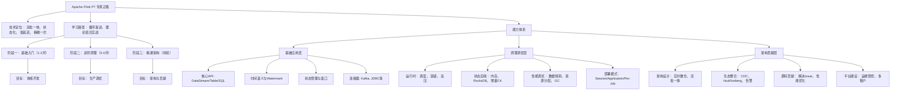

本文系统梳理了Apache Flink的技术体系与学习路径。文章首先明确了Flink在流处理领域低延迟、高吞吐、支持精确一次语义的技术优势。接着，通过架构图展示了其从核心引擎、API、连接器生态到部署运维的完整技术栈。

<!-- more -->


## 🎯 Flink 在分布式计算领域的地位

​**Flink 技术定位矩阵**：

```
流处理领域：Flink vs Spark Streaming vs Storm
├── 低延迟：Flink (毫秒级) > Spark Streaming (秒级) > Storm (毫秒级)
├── 高吞吐：Flink ≈ Spark Streaming > Storm
├── 精确一次语义：Flink (原生支持) > Spark Streaming (微批处理) > Storm (Trident)
└── 状态管理：Flink (强大) > Spark Streaming (有限) > Storm (弱)
```

## 📊 Flink 技术体系架构图

```
Flink 完整技术栈
├── 核心引擎层
│   ├── 运行时架构
│   │   ├── JobManager (作业管理器)
│   │   ├── TaskManager (任务管理器)  
│   │   └── ResourceManager (资源管理器)
│   ├── 内存管理
│   │   ├── 网络缓冲区
│   │   ├── 托管内存
│   │   └── 原生内存
│   └── 容错机制
│       ├── Checkpoint (检查点)
│       ├── Savepoint (保存点)
│       └── 状态后端
├── API 层
│   ├── DataStream API (流处理)
│   ├── DataSet API (批处理，已渐淘汰)
│   ├── Table API & SQL
│   └── Python API
├── 连接器生态
│   ├── 输入连接器
│   │   ├── Kafka
│   │   ├── File System
│   │   ├── RabbitMQ
│   │   └── 自定义 Source
│   ├── 输出连接器
│   │   ├── Kafka
│   │   ├── Elasticsearch
│   │   ├── JDBC
│   │   └── 自定义 Sink
│   └── 格式支持
│       ├── JSON
│       ├── Avro
│       ├── Parquet
│       └── Protobuf
├── 部署模式
│   ├── Session 模式
│   ├── Per-Job 模式
│   ├── Application 模式
│   └── 云原生部署
└── 运维监控
    ├── Metrics 系统
    ├── Web UI
    ├── 日志集成
    └── 告警系统
```

## 🚀 Flink 学习路线

### 1. 技术定位与核心价值

​**Apache Flink 的定位：** 

Apache Flink 是一个​**有状态的、高吞吐、低延迟的分布式流数据处理框架**​。其核心设计理念是 ​ **“流处理优先”**  ，将批处理视为流处理的一种特例（有界流）。这使其在实时计算领域占据了架构上的制高点。

​**解决的关键问题：** 

1. ​**数据的绝对准确性**​：通过其​**状态（State）** ​ 和​**精确一次（Exactly-Once）**  状态一致性保证，解决了在分布式环境下因故障、重试等原因可能导致的数据丢失或重复计算的问题。这是与早期 Storm 框架（At-Least-Once）的核心差异。
2. ​**高吞吐与低延迟的统一**：Flink 的流水线式数据传输模型避免了 Spark Streaming 的微批次（Micro-Batch）模型带来的固有延迟，实现了真正的实时处理（毫秒级延迟），同时保持高吞吐。
3. ​**复杂事件处理（CEP）与状态管理**：内置强大的状态后端（State Backend）和窗口（Window）机制，使得在流上实现复杂的业务逻辑（如会话窗口、模式匹配）变得简单可靠。
4. ​**流批一体**：统一的 API 和数据执行引擎，降低了学习和维护成本，实现了真正意义上的流批一体数据处理。

​**与 Spark、Storm 的对比：** 

|特性|Apache Flink|Apache Spark (Streaming)|Apache Storm|
| ----| --------------------| ------------------------------------| ------------|
|​**处理模型**|​**真正的流处理**|​**微批处理**|真正的流处理|
|​**延迟**|​**毫秒级**|秒级|​**毫秒级**|
|​**状态管理**|​**内置，强大**（内存/RocksDB）|需借助外部系统（如 Redis）或较新 API|弱，需自实现|
|​**一致性保证**|​**精确一次**|精确一次|至少一次|
|​**吞吐量**|​**非常高**|高|一般|
|​**架构理念**|​**流批一体**（批是流的特例）|批流分离（流是批的模拟）|纯流处理|

​**核心结论：** ​ Flink 在实时处理领域，尤其是在要求​**高准确性、低延迟、状态复杂**的场景下，具有显著优势，是目前业界实时计算的事实标准。

---

### 2. P7 级别能力体系图

一名 Flink P7 专家需要具备从应用到底层的全链路深度理解能力。其能力体系是一个金字塔结构：

```
graph TD
    A[P7 Flink 专家能力体系] --> B1(顶层： 架构设计与生态整合)；
    A --> B2(中层： 核心原理与深度调优)；
    A --> B3(底层： 扎实基础与熟练应用)；

    B1 --> C1[实时数仓设计与搭建]；
    B1 --> C2[多引擎融合架构 （Flink + CDC + Hudi/Iceberg）]；
    B1 --> C3[大规模集群运维与资源治理]；
    B1 --> C4[贡献社区/解决极端问题]；

    B2 --> C5[运行时机制： 调度、容错、反压、网络栈]；
    B2 --> C6[状态管理深度： 状态后端、TTL、扩缩容]；
    B2 --> C7[SQL 引擎与优化器]；
    B2 --> C8[源码贡献与定制化]；

    B3 --> C9[核心API： DataStream, Table/SQL]；
    B3 --> C10[时间语义与窗口]；
    B3 --> C11[状态类型与使用]；
    B3 --> C12[连接器与序列化]；
```

​**解读：** 

- ​**底层**：是基础，要求熟练无误地使用 Flink 解决常见业务问题。
- ​**中层**：是区分资深工程师和高级工程师的关键。必须理解内部工作机制，才能进行有效的性能调优和故障排查。
- ​**顶层**：是 P7 价值的体现，能够站在业务和全局技术架构的角度，设计和领导实施基于 Flink 的稳定、高效、可扩展的实时数据平台。

---

### 3. 循序渐进的学习路径

#### 阶段一：基础入门与核心 API 掌握（1-2 个月）

- ​**目标**：能够独立编写和部署常见的实时数据处理任务。
- ​**核心知识点**：

  - Flink 架构：JobManager, TaskManager, Client, Operator Chain, Task Slot。
  - DataStream API：基本转换（Map/Filter/FlatMap）、KeyedProcessFunction、窗口（Window）、触发器（Trigger）。
  - ​**时间语义**​：​**事件时间、处理时间、摄入时间**​ 及其核心重要性。​**Watermark** 机制的原理与实现。
  - ​**状态管理**：Operator State, Keyed State。ValueState, ListState, MapState 的使用场景。
  - Table API & SQL：基础的 DDL 和查询语法。
  - 连接器：Kafka Source/Sink, JDBC Sink, File Sink。
- ​**学习/实践方式**：

  - ​**理论学习**：阅读 Flink 官方文档，特别是 Concepts 部分。
  - ​**实战项目**：

    1. ​**实时数据 ETL**：从 Kafka 读取 JSON 数据，进行清洗、转换后写入 Kafka 或数据库。
    2. ​**实时聚合统计**：实现一个基于事件时间的滚动/滑动窗口，计算每分钟的 PV/UV。
    3. ​**模拟异常检测**：使用 ProcessFunction 实现一个简单的异常模式检测（如短时间内连续登录失败）。

#### 阶段二：进阶原理与生产环境实践（3-4 个月）

- ​**目标**：深入理解 Flink 内部机制，能够解决生产环境中遇到的性能、稳定性问题。
- ​**核心知识点**：

  - ​**检查点与保存点**​：​**Chandy-Lamora 算法** 原理。如何配置、触发、恢复？保存点用于版本升级和扩缩容。
  - ​**状态后端深度探秘**​：MemoryStateBackend, FsStateBackend, ​**RocksDBStateBackend** 的底层实现差异、优缺点和适用场景。增量检查点原理。
  - ​**反压监控与处理**：反压的产生原因，如何通过 Web UI 和 Metrics 监控？定位反压根源（数据倾斜、GC、外部系统瓶颈）。
  - ​**数据倾斜解决方案**：LocalKeyBy、两阶段聚合、自定义分区器。
  - ​**资源管理与部署**：在 YARN/K8s 上的部署模式（Session/Application/Per-Job），资源分配策略。
  - ​**SQL 引擎进阶**：窗口 TVF，维表 Join（Async I/O），CDC 集成。
- ​**学习/实践方式**：

  - ​**深度阅读**：阅读官方文档中 Deployment、Ops、Tuning 部分。阅读 Flink 核心贡献者的技术博客和 PPT。
  - ​**源码阅读**​：选择性阅读关键路径的源码，如 `StreamTask` ​的执行、`CheckpointCoordinator` ​的触发。
  - ​**实战项目**：

    1. ​**构建实时数仓 DWD 层**：使用 Flink SQL 实现复杂业务的 ETL 和维度关联。
    2. ​**模拟故障与恢复**：主动杀死 TaskManager，观察作业如何从 Checkpoint 自动恢复。练习用 Savepoint 进行有状态升级。
    3. ​**性能调优**：对一个存在数据倾斜或反压的作业，进行诊断和优化，并记录优化前后的指标对比。

#### 阶段三：精通、架构与贡献（持续学习）

- ​**目标**：具备架构设计能力，能解决极端复杂问题，并能向社区贡献代码或最佳实践。
- ​**核心知识点**：

  - ​**网络栈与序列化**：Netty 的使用、Buffer Pool、序列化框架（Kyro/Avro）的性能优化。
  - ​**自定义优化**：编写自定义 Source/Sink、自定义窗口、自定义 StateBackend（了解原理）。
  - ​**实时数仓架构**​：Lambda/Kappa 架构的演进。基于 ​**Flink + CDC + Hudi/Iceberg** 的流批一体数据湖方案。
  - ​**大规模集群运维**：监控告警体系（Prometheus + Grafana）、日志收集、自动化部署与运维平台建设。
  - ​**社区参与**：阅读 FLIP，了解社区发展方向。从解决 JIRA Issue、提交 Bug Fix 开始参与贡献。
- ​**学习/实践方式**：

  - ​**架构设计**：为一个中等规模的业务设计并主导实现一套完整的实时数据平台。
  - ​**源码攻坚**：针对生产环境中遇到的疑难杂症，深入源码层面定位根本原因。
  - ​**分享与输出**：在团队或技术社区分享你的深度实践和源码解析，形成技术影响力。

---

### 4. 总结性思维导图

下图总结了成为一名 Flink P7 专家所需构建的完整知识体系。您可以将此图作为学习地图和查漏补缺的清单。



**学习建议：**

学习过程中，务必坚持  **“动手实践 -&gt; 遇到问题**  **-&gt;**  **探究原理**  **-&gt;; 总结归纳”**  的循环。理论知识需要通过实战来巩固和深化。

## 后记

可供参考的生成这篇文章的 prompt 如下：

Flink 的技术体系：

```bash
请为我提供 Apache Flink在分布式计算领域的地位以及技术体系，要求达到阿里 P7 及以上水平。
```

Flink 学习路线：

```bash
请为我制定一个从零开始学习 Apache Flink 的进阶路线，目标达到阿里 P7 级别资深工程师的水准。回答需要包含以下四个核心部分：

1.  **技术定位与核心价值**：阐述 Flink 在分布式计算领域的地位，它解决了哪些关键问题，并与 Spark、Storm 等技术进行对比。
2.  **P7 级别能力体系图**：以架构图或分层图的形式，展示一名 Flink P7 专家需要掌握的技术栈，包括但不限于 API、运行时、容错、状态管理、资源整合、实时数仓、源码贡献等。
3.  **循序渐进的学习路径**：设计一个分阶段的学习计划，从入门、进阶到精通，每个阶段明确学习目标、核心知识点和推荐的学习/实践方式。
4.  **总结性思维导图**：最后用一张思维导图总结整个知识体系，便于复习和查漏补缺。

要求：内容需有深度，体现对内部原理、生产环境挑战和架构设计能力的理解，而非简单的 API 使用。
```

## 参考

[https://yuanbao.tencent.com/chat/naQivTmsDa/66c10467-41b7-4233-9df0-3eb5b4255751](https://yuanbao.tencent.com/chat/naQivTmsDa/66c10467-41b7-4233-9df0-3eb5b4255751)
